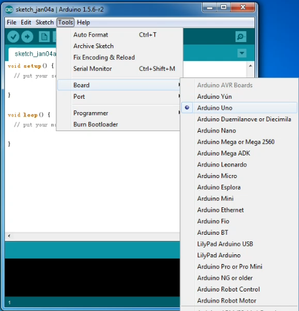

# 3、Arduino

# 3.1、Arduino IDE和驱动的安装

当我们拿到开发板时，首先我们要安装Arduino IDE和驱动，相关文件我们可以在官网上找到，以下链接是包含各种系统、各种版本的Arduino IDE和驱动任你选择。

<https://www.arduino.cc/en/Main/OldSoftwareReleases#1.5.x>

下面我们介绍下Arduino-1.5.6 版本IDE在Windows系统的安装方法。

下载下来的文件是一个arduino-1.5.6-r2-windows.zip的压缩文件夹，解压出来到硬盘。

双击Arduino-1.5.6 .exe文件

然后

然后

等待安装完成.点击close，安装完成。

1.5.6版本安装后的样子。

接下来是开发板驱动的安装，这次我们安装的是Keyes UNO R3
开发板的驱动，Keyes 2560 R3
开发板安装驱动方法和这个类似，驱动文件可以用同一个文件。

不同的系统，安装驱动的方法也有一些细小的区别，下面我们介绍在WIN 7系统安装驱动的方法。

第一次Keyes UNO R3
开发板连接电脑时，点击计算机--属性--设备管理器，显示如下图。

点击 Unknown device 安装驱动，如下图。

进入下图，选择

找到Arduino安装位置的drivers文件夹

点击“Next”，今天下图选择，开始安装驱动

安装驱动完成，出现下图点击Close。

这样驱动就装好了。点击计算机--属性--设备管理器，我们可看见如下图。

# 3.2、Arduino IDE的使用方法

Keyes UNO R3
开发板的USB驱动安装成功之后，我们可以在Windows设备管理器中找到相应的串口。

下面示范第一个程序的烧写，串口监视器中显示“Hello World！”。

测试代码为：

int val;

int ledpin=13;

void setup()

{

Serial.begin(9600);

pinMode(ledpin,OUTPUT);

}

void loop()

{

val=Serial.read();

if(val=='R')

{

digitalWrite(ledpin,HIGH);

delay(500);

digitalWrite(ledpin,LOW);

delay(500);

Serial.println("Hello World!");

}

}

我们打开Arduino 的软件，编写一段程序让Keyes UNO R3
开发板接受到我们发的指令就显示“Hello World！”字符串；我们再借用一下Keyes UNO R3 开发板上的 D13
的指示灯，让Keyes UNO R3
开发板接受到指令时指示灯闪烁一下，再显示“Hello World！”。

打开Arduino 的软件，设置板，如下。

设置COM端口，如下

点击编译程序，检查程序是否错误；点击上传程序；Keyes UNO R3 开发板设置OK后右下脚显示如下图，和设备管理器中显示一致。

上传成功，输入R，点击发送，Keyes UNO R3 开发板上的 D13
的指示灯闪烁一次，串口监视器中显示 Hello World! 如下图

那么恭喜你，你的第一个程序已经成功了！！！

# 3.3、实验课程

## 实验一 LED 闪烁实验

实验说明

LED 闪烁实验是比较基础的实验之一，上一个“ Hello World！”实验里已经利用到了Arduino 自带的LED，这次我们利用其他I/O
口和外接直插LED 灯来完成这个实验。

实验器材

开发板\*1

USB线\*1

LED\*1

220Ω 电阻\*1

面包板\*1

面包板连接线若干

接线图

测试代码

int led = 2; //定义数字口2

void setup()

{

  pinMode(led, OUTPUT);     //设置led为输出

}

void loop()

{

  digitalWrite(led, HIGH);   //开启led

  delay(1000); //延迟1秒

  digitalWrite(led, LOW);    //关闭led

  delay(1000);//延迟1秒

}

测试结果

下载完程序就可以看到我们的IO口外接小灯在闪烁了，这样我们的实验现象为LED不停闪烁，间隔大约为1秒。

## 实验二 呼吸灯实验

实验说明

上一课程中我们只是控制LED的亮和灭，那么我们可以怎么控制LED的亮度呢？本课程中我们把LED接到PWM口中，然后通过改变PWM数值，调节LED亮度，使LED逐渐变亮，和逐渐变暗，从而达到呼吸灯的效果。

实验器材

开发板\*1

USB线\*1

LED\*1

220Ω 电阻\*1

面包板\*1

面包板连接线若干

接线图

测试代码

int ledPin = 3; // 定义数字口3

void setup()

{

pinMode(ledPin, OUTPUT);// 将ledPin设置为输出

}

void loop()

{

for (int a=0; a\<=255;a++)// 设置使LED逐渐变亮

{

analogWrite(ledPin,a); //
开启led,调节亮度，范围是0-255，在255时led最亮

delay(10); // 延迟0.01S

}

for (int a=255; a\>=0;a--) // 设置使LED逐渐变暗

{

analogWrite(ledPin,a); //
开启led,调节亮度，范围是0-255，在255时led最亮

delay(10); // 延迟0.01秒

}

delay(1000);// 延迟1秒

}

测试结果

下载完程序就可以看到我们的IO口外接小灯显示出呼吸灯的效果，小灯先逐渐变亮，后逐渐变暗，循环交替。

## 实验三 广告灯实验

实验说明

在生活中我们经常会看到一些由各种颜色的led灯组成的广告牌，广告牌上各个位置上癿led灯不断的变话,形成各种效果。本节实验就是利用led灯编程模拟广告灯效果。

实验器材

开发板\*1

USB线\*1

LED\*5

220Ω 电阻\*5

面包板\*1

面包板连接线若干

接线图

测试代码

int BASE = 2 ; //第一个 LED 接的 I/O 口

int NUM = 5; //LED 的总数

void setup()

{

for (int i = BASE; i \< BASE + NUM; i ++)

{

pinMode(i, OUTPUT); //设定数字I/O口为输出

}

}

void loop()

{

for (int i = BASE; i \< BASE + NUM; i ++)

{

digitalWrite(i, HIGH); //设定数字I/O口输出为"高"，即逐渐开灯

delay(200); //延迟

}

for (int i = BASE; i \< BASE + NUM; i ++)

{

digitalWrite(i, LOW); //设定数字I/O口输出为"低"，即逐渐关灯

delay(200); //延迟

}

}

测试结果

下载完程序就可以看到我们的IO口外接小灯先逐渐变亮，然后逐渐变暗，循环交替。

## 实验四 交通灯实验 

实验说明

前面我们已经完成了单个小灯的控制实验，接下来我们就来做一个稍微复杂一点的交通灯实验，其实聪明的朋友们可以看出来这个实验就是将上面单个小灯的实验扩展成3
个颜色的小灯，就可以实现我们模拟交通灯的实验了。

实验器材

红色LED\*1

黄色LED\*1

绿色LED\*1

220Ω电阻\*3

面包板\*1

面包板连接线若干

接线图

测试代码

int redled =10; //定义数字10 接口

int yellowled =7; //定义数字7 接口

int greenled =4; //定义数字4 接口

void setup()

{

pinMode(redled, OUTPUT);//定义红色小灯接口为输出接口

pinMode(yellowled, OUTPUT); //定义黄色小灯接口为输出接口

pinMode(greenled, OUTPUT); //定义绿色小灯接口为输出接口

}

void loop()

{

digitalWrite(greenled, HIGH);////点亮 绿灯

delay(5000);//延时5秒

digitalWrite(greenled, LOW); //熄灭 绿灯

for(int i=0;i\<3;i++)//闪烁交替三次，黄灯闪烁效果

{

delay(500);//延时0.5 秒

digitalWrite(yellowled, HIGH);//点亮 黄灯

delay(500);//延时0.5 秒

digitalWrite(yellowled, LOW);//熄灭 黄灯

}

delay(500);//延时0.5 秒

digitalWrite(redled, HIGH);//点亮 红灯

delay(5000);//延时5 秒

digitalWrite(redled, LOW);//熄灭 红灯

}

测试结果

按照接线图接好线，上传完程序，上电后，我们就可以看到我们自己设计控制的交通灯了。实验效果为绿灯亮5秒，绿灯熄灭，黄灯循环闪烁3次，红灯亮5秒，依次循环。

## 实验五 按键控制LED实验

实验说明

I/O 口的意思即为INPUT 接口和OUTPUT
接口，到目前为止我们设计的小灯实验都还只是应用到Arduino 的I/O
口的输出功能，这个实验我们来尝试一下使用Arduino的I/O
口的输入功能即为读取外接设备的输出值，我们用一个按键和一个LED
小灯完成一个输入输出结合使用的实验，让大家能简单了解I/O 的作用。

实验器材

开发板 \*1

USB线\*1

LED\*1

轻触按键\*1

220Ω 电阻\*1

10KΩ 电阻\*1

面包板\*1

面包板连接线若干

接线图

测试代码

int ledPin = 11; //定义数字口11

int inputPin = 3; //定义数字口3

void setup()

{

pinMode(ledPin, OUTPUT); //将ledPin设置为输出

pinMode(inputPin, INPUT); //将inputPin设置为输入

}

void loop()

{

int val = digitalRead(inputPin);

//设置数字变量val，读取到数字口3的数值，并赋值给 val

if (val == LOW) //当val为低电平时，LED变暗

{

digitalWrite(ledPin, LOW); // LED变暗

}

else

{

digitalWrite(ledPin, HIGH); // LED亮起

}

}

测试结果

下载完程序，上电后，当按键按下时小灯亮起，否则小灯不亮。

## 实验六 抢答器实验

实验说明

完成上面的实验以后相信已经有很多朋友可以独立完成这个实验了，我们可以将上面的按键控制小灯的实验扩展成4个按键对应3
个小灯，占用7个数字I/O
接口。本实验中我们利用4个按键控制3个LED灯，从而达到抢答器的效果。

实验器材

开发板\*1

USB线\*1

LED灯\*3

轻触按键\*4

10KΩ 电阻\*4

220Ω 电阻\*3

面包板\*1

面包板连接线若干

杜邦线若干

接线图

测试代码

int redled=9;

int yellowled=10;

int greenled=11;

int redpin=5;

int yellowpin=4;

int greenpin=3;

int restpin=2;

int red;

int yellow;

int green;

void setup()

{

pinMode(redled,OUTPUT);

pinMode(yellowled,OUTPUT);

pinMode(greenled,OUTPUT);

pinMode(redpin,INPUT);

pinMode(yellowpin,INPUT);

pinMode(greenpin,INPUT);

}

void loop()

{

red=digitalRead(redpin);

yellow=digitalRead(yellowpin);

green=digitalRead(greenpin);

if(red==LOW)RED_YES();

if(yellow==LOW)YELLOW_YES();

if(green==LOW)GREEN_YES();

}

void RED_YES()

{

while(digitalRead(restpin)==1)

{

digitalWrite(redled, HIGH);

digitalWrite(yellowled, LOW);

digitalWrite(greenled, LOW);

}

clear_led();

}

void YELLOW_YES()

{

while(digitalRead(restpin)==1)

{

digitalWrite(redled, LOW);

digitalWrite(yellowled, HIGH);

digitalWrite(greenled, LOW);

}

clear_led();

}

void GREEN_YES()

{

while(digitalRead(restpin)==1)

{

digitalWrite(redled, LOW);

digitalWrite(yellowled, LOW);

digitalWrite(greenled, HIGH);

}

clear_led();

}

void clear_led()

{

digitalWrite(redled, LOW);

digitalWrite(yellowled, LOW);

digitalWrite(greenled, LOW);

}

测试结果

按照接线图接线，上传完程序，上电后，一个简单的抢答器就做好了，我们根据亮起不同的LED灯，判断谁抢答成功。在复位后，三个LED灯关闭。

## 实验七 电位器调控灯光亮度实验

实验说明

在第二课程中我们直接通过PWM口控制灯的亮度，从而达到呼吸灯的效果。在这课程中我们通过一个电位器，利用电位器调节PWM值，从而控制灯的亮度。

实验器材

开发板\*1

USB线\*1

LED\*1

220Ω 电阻\*1

可调电位器\*1

面包板\*1

面包板连接线若干

接线图

测试代码

int ledpin=11;//定义数字接口11（PWM 输出）

void setup()

{

pinMode(ledpin,OUTPUT);//定义数字接口11 为输出

Serial.begin(9600);//设置波特率为9600

}

void loop()

{

int val=analogRead(0);//读取模拟口A0口的值

val = map(val, 0, 1023, 0, 255);//从0-1023映射到0-255

Serial.println(val);//显示val 变量

analogWrite(ledpin,val);// 打开LED 并设置亮度

delay(100);//延时0.1 秒

}

测试结果

下载完程序后。我们可以通过旋转可调电位器控制小灯的亮度，打开串口监视器，设置波特率为9600，就可看到调节LED亮度的PWM值。

## 实验八 有源蜂鸣器实验

实验说明

蜂鸣器可分为有源蜂鸣器和无源蜂鸣器两种。本课程中主要用到了有源蜂鸣器，有源蜂鸣器内部有一简单的振荡电路，能将恒定的直流电转化成一定频率的脉冲信号。实验中中我们只需要给蜂鸣器输入一个高电平信号，蜂鸣器响起。

实验器材

开发板\*1

USB线\*1

有源蜂鸣器\*1

面包板\*1

面包板连接线若干

接线图

测试代码

int buzzer = 2; //定义数字口2

void setup()

{

  pinMode(buzzer, OUTPUT);     //设置buzzer为输出

}

void loop()

{

  digitalWrite(buzzer, HIGH);   //开启buzzer

  delay(1000); //延迟1S

  digitalWrite(buzzer, LOW);    //关闭buzzer

  delay(1000);//延迟1S

}

测试结果

下载完程序后，我们可以听到蜂鸣器响1秒，停止响起1秒，循环交替。

## 实验九 74HC595实验

实验说明

74HC595 简单说来就是具有8 位移位寄存器和一个存储器，以及三态输出功能。
这里我们用它来控制8 个LED 小灯。我们为什么要用74HC595
来控制小灯呢？一定会有
很多朋友会问这个问题，我想问的是我们要是单纯的用Arduino 控制8
个小灯的话要占用多少个I/O 呢？答案是8 个，但是我们的Arduino 168
有几个I/O 口呢？加上模拟接口也就20 个吧，这8
个小灯占用了太多的资源了，我们用74HC595 的目的就是减少I/O
口的使用数量。用74HC595 以后我们可以用3 个数字I/O 口控制8 个LED
小灯岂不美哉。

实验器材

开发板 \*1

USB线\*1

74HC595 DIP\*1

红色LED\*8

220Ω 电阻\*8

面包板\*1

面包板连接线若干

接线图

测试代码

int data = 2;//74HC595的2脚 数据输入引脚SI

int clock = 5;//74hc595的4脚 时钟线 SCK

int latch = 4;//74hc595的5脚 输出存储器锁存线RCK

int ledState = 0;

const int ON = HIGH;

const int OFF = LOW;

void setup()

{

pinMode(data, OUTPUT);

pinMode(clock, OUTPUT);

pinMode(latch, OUTPUT);

}

void loop()

{

for(int i = 0; i \< 256; i++)

{

updateLEDs(i);

delay(500);

}

}

void updateLEDs(int value)

{

digitalWrite(latch, LOW);//

shiftOut(data, clock, MSBFIRST, ~value);//串行数据输出，高位在先

digitalWrite(latch, HIGH);//锁存

}

测试结果

下载完程序大家就可以看到8 个小灯闪烁的美妙场景了。

实验现象是看到八位LED显示八位二进制数，循环自加1。

## 实验十 4N35实验

实验说明

4N35是一款通用光电耦合器，包含一个砷化镓红外发光二极管，并用该二极管驱动硅光电晶体管。4N35的封装类型是6脚双列直插封装。

实验器材

开发板 \*1

USB线\*1

4n35 \*1

红色LED\*1

220Ω 电阻\*3

面包板\*1

面包板连接线若干

接线图

测试代码

int Optocoupler=8;

void setup()

{

pinMode(Optocoupler,OUTPUT);

}

void loop()

{

digitalWrite(Optocoupler,LOW);

delay(1000);

digitalWrite(Optocoupler,HIGH);

delay(1000);

}

测试结果

连接好线，上传代码，通电后，红色LED灯闪烁，亮1S，灭1S。

## 实验十一 ULN2803APG驱动5V步进电机

实验说明

ULN2803是8个NPN
达林顿晶体管，连接在阵列非常适合逻辑接口电平数字电路（例如TTL ，CMOS
或PMOS 上/
NMOS）和较高的电流/电压，如电灯，电磁阀，继电器，打印锤或其他类似的负载。该电路为反向输出型，即输入低电平电压，输出端才能导通工作。实验中我们用一个ULN2803驱动驱动24BYJ48五线四相减速步进电机转动。

实验器材

开发板 \*1

USB线\*1

5V步进电机 \*1

ULN2803APG \*1

220Ω 电阻\*4

面包板\*1

面包板连接线若干

设置方法

注意电机参数，电压5V，步距角5.625，减速比1：64

1、计算A-B-C-D通电一次转动的角度5.625X2X4/64=0.703125  (2是表示1相励磁方式每步是2倍的步距角，4表示走了4步，64指电机减速比)  

2、转动360度循环ABCD通电的次数360/0.7031=512

接线图

测试代码

void setup()

{

for(int i=8;i\<12;i++)

{

pinMode(i,OUTPUT);

}

}

void loop()

{

int a;

a=512;

while(a--)

{

for(int i=11;i\>7;i--)

{

digitalWrite(i,1);

delay(10);

digitalWrite(i,0);

}

}

}

测试结果

连接好线，上传代码，通电后，步进电机缓慢转动。

