# 2、清单

|编码|名称|描述|数量|图片|
|-|-|-|-|-|
|1|LED|F5-红发红-短|10||
|2|LED|F5-黄发黄-短|10||
|3|LED|F5-绿发绿-短|10||
|4|电阻|碳膜色环 1/4W 1% 100R 编带|10||
|5|电阻|碳膜色环 1/4W 1% 220R 编带|10||
|6|电阻|碳膜色环 1/4W 1% 470R 编带|10||
|7|电阻|碳膜色环 1/4W 1% 1K 编带|10||
|8|电阻|碳膜色环 1/4W 1% 2.2K 编带|10||
|9|电阻|碳膜色环 1/4W 1% 4.7K 编带|10||
|10|电阻|碳膜色环 1/4W 1% 10K 编带|10||
|11|电阻|碳膜色环 1/4W 1% 22K 编带|10||
|12|电阻|碳膜色环 1/4W 1% 100K 编带|10||
|13|电阻|碳膜色环 1/4W 1% 330K 编带|10||
|14|电阻|碳膜色环 1/4W 1% 1M 编带|10||
|15|陶瓷电容|22PF 2.54|10|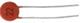|
|16|陶瓷电容|10NF 103 2.54|10|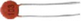|
|17|陶瓷电容|100NF 104 2.54|10|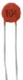|
|18|电解电容|1UF 50V 4*7MM 插件|10|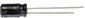|
|19|电解电容|10UF 16V 3*5MM 插件|10|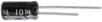|
|20|电解电容|100UF 16V 5*11MM 插件|10|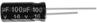|
|21|可调电位器|3386 MU 103（三针直排）|1|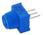|
|22|轻触按键|12*12*7.3MM 插件|5|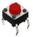|
|23|三极管|BC547 TO-92|2|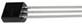|
|24|三极管|BC557 TO-92|2|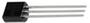|
|25|三极管|2N3904 TO-92|2|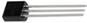|
|26|三极管|2N3906 TO-92|2|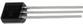|
|27|蜂鸣器|有源 12*9.5MM 5V 普通分体 2300Hz|1|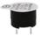|
|28|IC|LD1117 3.3V（直针）DIP|3|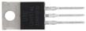|
|29|IC|4N35白色原装DIP-6|2|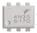|
|30|IC|74HC595 DIP|1|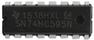|
|31|IC|ULN2803APG TOSHIBA DIP|1||
|32|面包线|面包板连接线65根|1||
|33|面包板|830孔 ZY-102（ 未包装）|1|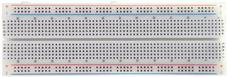|
|34|鱼夹线|45CM 一扎10条5种颜色 两端带鳄鱼夹|1|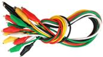|
|35|电阻卡|100*70MM|1|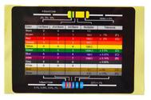|
