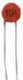
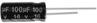
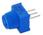
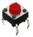
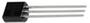
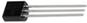
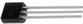
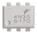
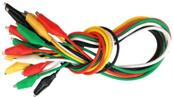

.. _2、清单:

2、清单
=======

.. container:: table-wrapper

   ==== ========== ================================= ==== =========
   编码 名称       描述                              数量 图片
   ==== ========== ================================= ==== =========
   1    LED        F5-红发红-短                      10   |image1|
   2    LED        F5-黄发黄-短                      10   |image2|
   3    LED        F5-绿发绿-短                      10   |image3|
   4    电阻       碳膜色环 1/4W 1% 100R 编带        10   |image4|
   5    电阻       碳膜色环 1/4W 1% 220R 编带        10   |image5|
   6    电阻       碳膜色环 1/4W 1% 470R 编带        10   |image6|
   7    电阻       碳膜色环 1/4W 1% 1K 编带          10   |image7|
   8    电阻       碳膜色环 1/4W 1% 2.2K 编带        10   |image8|
   9    电阻       碳膜色环 1/4W 1% 4.7K 编带        10   |image9|
   10   电阻       碳膜色环 1/4W 1% 10K 编带         10   |image10|
   11   电阻       碳膜色环 1/4W 1% 22K 编带         10   |image11|
   12   电阻       碳膜色环 1/4W 1% 100K 编带        10   |image12|
   13   电阻       碳膜色环 1/4W 1% 330K 编带        10   |image13|
   14   电阻       碳膜色环 1/4W 1% 1M 编带          10   |image14|
   15   陶瓷电容   22PF 2.54                         10   |image15|
   16   陶瓷电容   10NF 103 2.54                     10   |image16|
   17   陶瓷电容   100NF 104 2.54                    10   |image17|
   18   电解电容   1UF 50V 4*7MM 插件                10   |image18|
   19   电解电容   10UF 16V 3*5MM 插件               10   |image19|
   20   电解电容   100UF 16V 5*11MM 插件             10   |image20|
   21   可调电位器 3386 MU 103（三针直排）           1    |image21|
   22   轻触按键   12\ *12*\ 7.3MM 插件              5    |image22|
   23   三极管     BC547 TO-92                       2    |image23|
   24   三极管     BC557 TO-92                       2    |image24|
   25   三极管     2N3904 TO-92                      2    |image25|
   26   三极管     2N3906 TO-92                      2    |image26|
   27   蜂鸣器     有源 12*9.5MM 5V 普通分体 2300Hz  1    |image27|
   28   IC         LD1117 3.3V（直针）DIP            3    |image28|
   29   IC         4N35白色原装DIP-6                 2    |image29|
   30   IC         74HC595 DIP                       1    |image30|
   31   IC         ULN2803APG TOSHIBA DIP            1    |image31|
   32   面包线     面包板连接线65根                  1    |image32|
   33   面包板     830孔 ZY-102（ 未包装）           1    |image33|
   34   鱼夹线     45CM 一扎10条5种颜色 两端带鳄鱼夹 1    |image34|
   35   电阻卡     100*70MM                          1    |image35|
   ==== ========== ================================= ==== =========

.. |image2| image:: media/c871ecd95ce2be359e1ac2babcfcfaeb.png

.. |image4| image:: media/f6a8649da4e79abb2f1d15479f073bb5.jpg
.. |image5| image:: media/f6a8649da4e79abb2f1d15479f073bb5.jpg
.. |image6| image:: media/f6a8649da4e79abb2f1d15479f073bb5.jpg
.. |image7| image:: media/f6a8649da4e79abb2f1d15479f073bb5.jpg
.. |image8| image:: media/f6a8649da4e79abb2f1d15479f073bb5.jpg
.. |image9| image:: media/f6a8649da4e79abb2f1d15479f073bb5.jpg
.. |image10| image:: media/f6a8649da4e79abb2f1d15479f073bb5.jpg
.. |image11| image:: media/f6a8649da4e79abb2f1d15479f073bb5.jpg
.. |image12| image:: media/f6a8649da4e79abb2f1d15479f073bb5.jpg
.. |image13| image:: media/f6a8649da4e79abb2f1d15479f073bb5.jpg
.. |image14| image:: media/f6a8649da4e79abb2f1d15479f073bb5.jpg
.. |image15| image:: media/c200abaaab6e66909db4246cfc40a5c3.jpg
.. |image16| image:: media/95b3a048aae8795c4e284634a810baa3.png

.. |image18| image:: media/8c8e8c7eccda8ec86489d22d8870254d.jpg
.. |image19| image:: media/965a119b842096e277c17c1223e6d8dc.jpg

.. |image23| image:: media/dfc919bf431240adce0d128778a6d4f2.jpg

.. |image27| image:: media/5a749ec6435e3982bf4dbdc5eaf7b51e.jpg
.. |image28| image:: media/77ae9b3c52da2cdf6ae018c8c557de9a.jpg

.. |image30| image:: media/af8baa67720daac977dee6d8262f97c9.jpg
.. |image31| image:: media/7ba65c213540a0e4140c501beaf10e0e.jpg
.. |image32| image:: media/a741fbc4b471318a5e3ef45f3871c07c.png
.. |image33| image:: media/48648e8442ff9d9c8f57ac99c46fdd04.jpg

.. |image35| image:: media/93852b245f0ae356fac222dadb3dbe24.jpg
